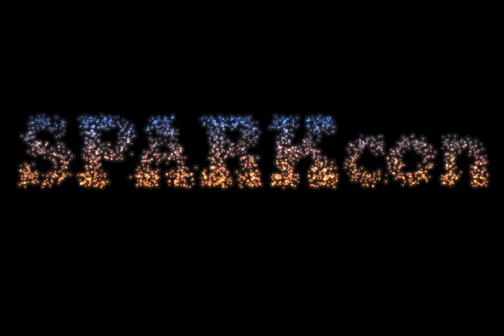

# Fireflies

A WebGL demo of drawing shapes with drifting particles.

## Setup

    npm install

## Development commands

Start a development environment with BrowserSync:

    npm start

BrowserSync will automatically reload your browser when files
change.  No more manual refreshing!  You can open the game in multiple browsers
and they will all be refreshed together.  Clicks will also be synchronized so
you can test the game in several browsers at the same time.
